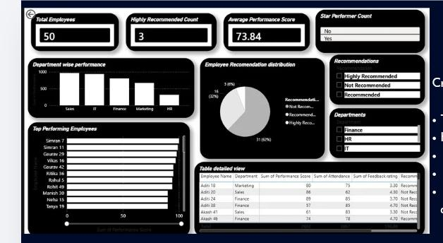

# 🚀 Employee Recommendation Engine

### ⚡ Powered by n8n | 📊 Data-Driven HR Decisions

---

## 🧠 What This Project Does

Imagine an HR assistant that **automatically evaluates employees** and tells you who deserves recognition, promotion, or improvement.

That’s exactly what this project does 👇

💡 It analyzes:

* Performance Scores
* Attendance Records

🎯 And intelligently classifies employees into:

* ⭐ **Highly Recommended**
* 👍 **Recommended**
* ❌ **Not Recommended**

---

## 🔍 Decision Logic (Smart Rules Engine)

The recommendation is based on:

⭐ Highly Recommended

Performance Score > 85

Attendance > 90%

👍 Recommended

Performance Score between 70 – 85

❌ Not Recommended

Performance Score < 70

---

## 🔄 Behind the Scenes (Workflow)

This automation runs like a pipeline:

1️⃣ Trigger workflow manually

2️⃣ Pull employee data from Google Sheets

3️⃣ Apply smart conditions using IF nodes

4️⃣ Classify employees into categories

5️⃣ Merge results into one dataset

6️⃣ Push updated results back to Google Sheets

---

## 📊 Insights Dashboard

The system doesn’t just process data — it **tells a story** 📈

🔹 What you can see:

* 👥 Total Employees
* 📊 Average Performance Score
* 🌟 Top Performers
* 🏢 Department-wise Analysis
* 📈 Recommendation Distribution

---

## 🛠️ Tech Stack

| Tool             | Purpose             |
| ---------------- | ------------------- |
| ⚙️ n8n           | Workflow Automation |
| 📄 Google Sheets | Data Storage        |
| 📊 Power BI      | Data Visualization  |

---

## 📸 Visual Preview

### 🧩 Workflow Architecture

### 📊 Dashboard View

---

## 🎯 Why This Matters

This system helps HR teams:

✔ Identify high-performing employees instantly

✔ Make faster, data-backed decisions

✔ Reduce manual evaluation effort

✔ Improve workforce planning

---

## 🌱 Future Scope

🚀 What can be added next:

* AI-based recommendation engine
* Real-time dashboard integration
* Employee sentiment analysis
* Automated email alerts

---

## 👩‍💻 Author 
Aparna Khurana
